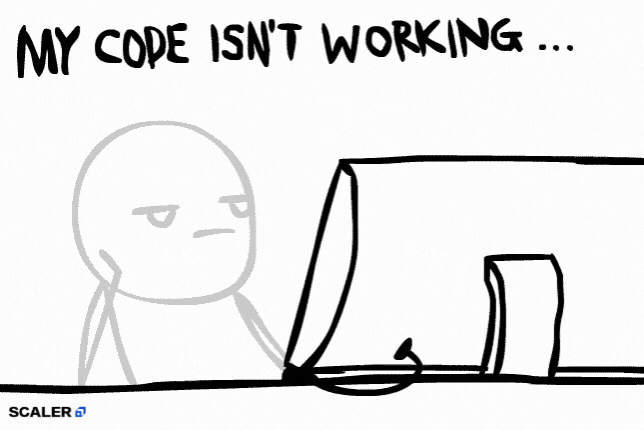

 

  

 

 

##  About Me

I'm **Ajeet Verma**, a Java Backend Developer specializing in building robust, secure, and scalable backend systems with the Spring ecosystem, paired with modern React front ends. Currently a Graduate Trainee at **Tata Consultancy Services (TCS)**.

- 🏢 Building enterprise-grade applications using Agile methodologies
- 🔐 Deep focus on authentication, authorization, and secure API design
- 🧠 Actively expanding into **Spring AI**, **RAG pipelines**, **AI Agents**, and **MCP**
- 🌱 Open to backend-focused, high-ownership engineering roles

## 💼 Professional Experience

<table>
<tr>
<td width="100%">

**Graduate Trainee** — Tata Consultancy Services (TCS)
`Jan 2026 – Present`

- Ranked **Top 5%** performer in TCS Ignite training program
- Contributing to enterprise applications using **Java, Spring, React, Python, and SQL**
- Practicing Agile development workflows across sprints and code reviews
- Hands-on with **Selenium** for automated testing and **JMeter** for performance testing
- Enforcing code quality using **SonarQube** and version control via **Git**
- Working with **Docker** for containerized application delivery

</td>
</tr>
<tr>
<td width="100%">

**Digital Workspace Services Trainee** — Wipro

- Gained exposure to enterprise IT operations and digital workspace tooling
- Strengthened foundations in troubleshooting, systems support, and workflows

</td>
</tr>
<tr>
<td width="100%">

**Frontend Development Intern** — Sipher Web Academy

- Built responsive user interfaces and strengthened core frontend fundamentals
- Collaborated on real-world frontend development tasks

</td>
</tr>
</table>

**🎓 Education**
**Bachelor of Computer Applications** — Dr. Ram Manohar Lohia Avadh University `2022 – 2025`

## 🎯 Current Focus

| Focus Area | Focus Area | Focus Area |
|:---:|:---:|:---:|
| Backend Development | Spring Boot | Spring Security |
| Spring AI | React | REST APIs |

**Currently Learning:** Spring AI · AI Agents · RAG · MCP · Vector Databases · Docker 

## 🛠️ Tech Stack

### Languages

&nbsp;
&nbsp;
&nbsp;
&nbsp;
&nbsp;

### Backend

&nbsp;
&nbsp;
&nbsp;

### Frontend

&nbsp;
&nbsp;
&nbsp;

### Database

&nbsp;
&nbsp;
&nbsp;

### DevOps & Tools

&nbsp;
&nbsp;
&nbsp;
&nbsp;
&nbsp;
&nbsp;
&nbsp;

### AI Stack — Currently Learning

&nbsp;

## 📊 GitHub Analytics

<!-- 
 -->

 

  

### Contribution Graph

## 💬 Dev Quote

<!-- 

## ☕ Support

If you find my work useful or interesting, consider supporting me:

 -->

## ⚡ Fun Fact

I debug backend systems the way I debug life — one stack trace at a time, always tracing the exception back to its root cause instead of settling for a quick catch block.

### 📫 Let's Connect

  

**Ajeet Verma** · Java Developer · Backend Engineer · Building systems that scale

  

